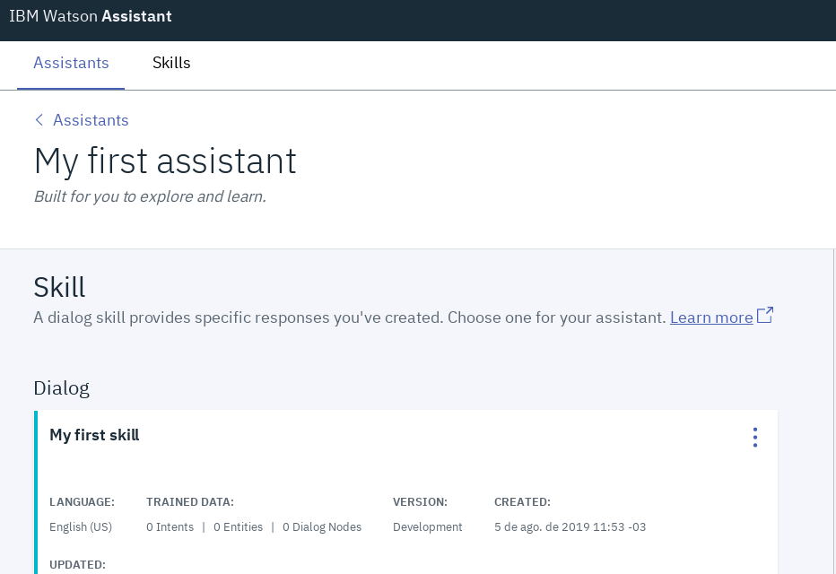

# WORKSHOP sobre Watson Assistant + Watson Discovery : 

Cree un asistente virtual que se ha capaz de responder a sus preguntas de manera inteligente y con personalidad. Ademas utilizando el servicio Watson Discovery para almacenar información sobre las charlas, el chatbot sera capaz de responder preguntas acerca de las charlas, sus horarios y recomendaciones sobre las mismas a través de los temas que abordan.

  

# Resumen

En la actualidad, la mayoria de las empresas estan comenzando a tener asistentes virtuales. Evite que sus clientes pierdan tiempo. IBM Watson Assistant estará disponible 24×7 para proporcionar una experiencia coherente, sostenible y funcional para sus clientes. Resuelva los requerimientos de sus usuarios de forma inmediata y eficiente. Gracias a IBM Watson Assistant, millones de organizaciones en el mundo han mejorado la atención de sus clientes atendiendo sus solicitudes.
Además tambien mejora las posibilidades y el nivel de ejecución llegando a simular con gran realismo conversaciones bastante complejas hacia cualquier tipo de usuario. ¡Más que un ChatBot un asistente cognitivo!

# Descripción

En este Workshop crearemos un asistente virtual capaz de responder preguntas acerca de las charlas pertenecientes al evento IBM Code Day. Se creara una instancia de Watson Asistant y otra de Watson Discovery en la nube de IBM. Luego continuamos con la skill donde estaran los datos de entrenamiento del asistente explicandose los conceptos fundamentales que deben tener encuenta a la hora de crear la logica de un chatbot. Cargaremos los documentos con la información de las charlas en discovery y finalizaremos utilizando un starter kit de Watson Assistant modificando algunos detalles de codigo para vincular los servicios y la logica de las consultas a Discovery.

# Pre- Requisitos

Tener una cuenta en IBM Cloud. <a href="https://cloud.ibm.com/registration">Link para registrarse en IBM Cloud</a>
Tener instalado Node.js y un IDE de trabajo (preferible Visual Studio Code)

# Watson Assistant Skill

Bueno para comenzar, el primer paso es crear una instancia del servicio Watson Assistant. Para esto, nos dirigimos al catalogo de IBM Cloud, en las categorias seleccionamos Inteligencia Artificial (AI) y luego buscamos el servicio nombrado anteriormente

  

Luego, para instanciar el servicio debemos darle un nombre al mismo, la region en la cual va a ser desplegado y seleccionar el plan Lite que la mayoria de los servicios de la nube provee. Vamos a ponerle de nombre 'WA_codeDay' y la region 'Dallas'

  

Una vez pronto todo lo anterior, damos click en 'Crear'. 
Siempre en la mayoria de los servicio de IBM Cloud vamos a tener dos items fundamentales, la documentacion del servicio y la referencia de API. Esto nos va a permitir aprender sobre las capacidades del servicio y sus utilidades, asi como también cuando queremos desde nuestra APP usar los servicios de la nube, mediante la API Reference tenemos todo bien detallado incluso para distintos lenguajes de programación como Java, Node.js, Python entre otros.

Ya creado el servicio vamos a acceder. Nos dirigimos a nuestra Lista de Recursos en el panel de la izquierda

  

Se mostraran los recursos que tenemos instanciados. Vamos a clickear la instancia de Watson Assistant

  

Y para ingresar clickeamos el boton que dice 'Iniciar Watson Assistant'. 

  

Se dara una explicación oral sobre la interfaz del servicio y sus utilidades.
Para cargar la skill, vamos a la pestaña ***Skills***

  

Y luego en ***Create skill***

  

Seleccionamos ***Dialog skill*** y luego vamos a la pestaña ***Import skill***. Cargamos el archivo json 'skillAsistant.json' ubicado en este repositorio y lo importamos. Esto cargara las intenciones, entidades y dialogo de nuestro asistente. Tambien se explicaran estos conceptos en el Workshop y la logica de dialogo diseñada.

  

# Watson Discovery

Bueno una vez pronto el asistente, vamos a crear una instancia de Watson Discovery para almacenar la información de nuestras charlas. Vamos nuevamente al catalogo de la nube, seleccionamos la categoria 'AI' y clickeamos sobre el servicio

  

Hacemos el paso a paso al igual que con la instancia de Watson Assistant, le ponemos de nombre 'codeDay_Discovery' e iniciamos el servicio

  

Vamos a crear una coleccion:

  

Le ponemos de nombre 'CodeDay_charlas' y seleccionamos la opcion de documentos en español

  

Pronta la coleccion subimos los documentos ubicados en la carpeta 'charlas' de este repositorio

  

Se explicaran detalles del servicio en el Workshop, y para finalizar con Discovery vamos a copiarnos sus credenciales.

  

Nos guardamos el 'Collection ID' y el 'Environment ID'.

# Starter KIT- Watson Assistant

Para vincular estos servicios de manera sencilla vamos a crear un starter kit de WA y luego desde el codigo vinculamos los servicio. Vamos nuevamente el catalogo, seleccionamos la categoria 'Kits de iniciador' y luego en 'Watson Assistant basic'

  

Luego clickeamos en ***Crear aplicación***. Nos saltaran un par de campos que debemos completar. Pondremos de nombre ***Starterkit_WA*** seleccionamos la opción Node.js

  

Y luego en el item ***Plan de precios*** seleccionamos nuestra instancia ya creada de Watson Assistant. Finalmente damos en ***Crear***

  

Nos aparecera lo siguiente, clickeamos en ***Descargar codigo*** para modificarlo localmente 

  

Lo descomprimimos en nuestra PC y luego abrimos nuestro IDE de trabajo para modificar algunos detalles del codigo

  

***CAMBIOS EN EL CODIGO***

-Debemos sustituir el archivo 'main.js' ubicado en 'server/routers' por el archivo main.js que dejamos en este repositorio. 
-Agregamos en la dirección 'server/services' el archivo 'Discovery.js' 
-Sustituimos en ese archivo las lineas 2,3 y 8 por nuestras credenciales: Environment ID, Collection ID y Apikey 
-Agregamos en el archivo 'package.json' la siguiente linea '"ibm-watson": "^4.2.1",' entre la linea 30 y 31. 

Prontos todos estos cambios abrimos una terminal situados en la carpeta que descomprimimos y corremos 'npm install' y luego 'npm start'.  

Abrimos un navegador y vamos a la siguiente URL: 'localhost:3000' deberia estar desplegada nuestra APP

